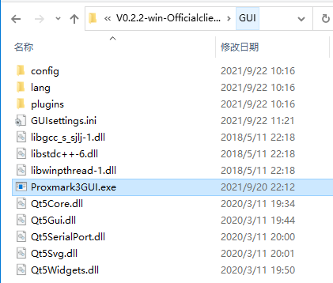
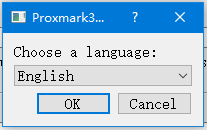
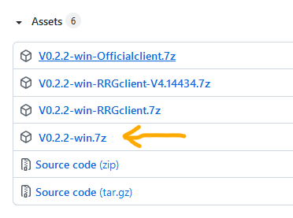
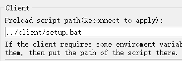
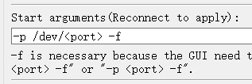

# Quickstart

***
**On Windows**
***
## Use GUI with included client
(1) Download the GUI with included client on [release](https://github.com/wh201906/Proxmark3GUI/releases) page  
  

(2) Extract the .7z file to a path. The target path should not contain non-ASCII characters  
  

(3) Open Proxmark3GUI.exe in the GUI folder, then select the language and click "OK". Now you can use it  
  
  

## Use the GUI with your own client
(1) Download the standalone GUI on [release](https://github.com/wh201906/Proxmark3GUI/releases) page  
  

(2) Extract the .7z file to a path. The target path should not contain non-ASCII characters. Make sure the client path and the GUI path are different.  

(3) Open the GUI. Input the client path in the "Client Path" editbox on the top of the main window.  
  

(4) Go to "Settings" panel. Input the config file path which matching the client you use.  
  

(5) If setup.bat is required, input the script path in the "Preload script path" editbox.
  

(6) If using RRG/Iceman repo, input "-p \<port\> -f" in the "Start arguments" editbox.
  

***
**On Linux**
***
(1) Build the GUI by following the instructions on [README](../../../README.md)  
(2) Config the GUI with the same steps of "On Windows"->"Use the GUI with your own client"  
(3) You might need to change "\<port\>" to "/dev/\<port\>" in "Settings"->"Start arguments" editbox  
  

(4) If you are using Raspbian(Raspberry OS), you might need to check "Keep the client active even the PM3 hardware is disconnected." in the "Steeings" panel  
  