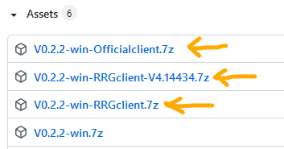
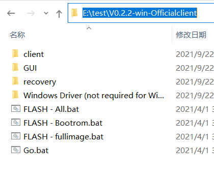
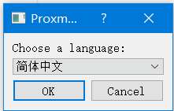
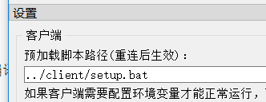

# 快速上手

***
**Windows用户**
***
## 使用包含客户端的版本
(1) 直接下载[release](https://github.com/wh201906/Proxmark3GUI/releases)当中包含客户端的版本即可  
  
（例如Vx.x.x-win-Officialclient.7z或Vx.x.x-win-RRGclient.7z，前者为官方客户端，后者为冰人版/RRG客户端）  

(2) 下载完成后将压缩包内所有内容解压到不含中文的路径当中  
  

(3) 双击GUI目录下的Proxmark3GUI.exe，选择语言，点击OK，即可正常运行  
  
  
***

## 使用现有客户端
(1) 下载[release](https://github.com/wh201906/Proxmark3GUI/releases)当中不包含客户端的版本  
  

(2) 解压到不含中文的路径当中  
（注意，GUI所在目录和PM3客户端所在目录不能相同）  

(3) 双击打开，选择语言，在顶端“客户端路径”当中填入proxmark3.exe的路径  
  

(4) 进入“设置”面板，根据自己使用的客户端类型（官方版/冰人版）选择正确的配置文件  
（./config/config_official.json或./config/config_rrgv4.13.json）  
  

(5) 若客户端启动时需要双击setup.bat启动，而setup.bat内会设置客户端运行时的环境变量，则需要在“预加载脚本路径”当中填入setup.bat的路径  
  

(6) 若使用的是冰人固件，则可能需要在“启动参数”当中填入“-p \<port\> -f”  
  

***
**Linux用户**
***
(1) 参考[README](../../README/README_zh_CN.md)当中的编译步骤手动编译Proxmark3GUI  
(2) 参考“Windows用户”->“使用现有客户端”的(2)~(6)步进行配置  
(3) “设置”->“启动参数”当中可能需要将“\<port\>”改为“/dev/\<port\>”  
  

(4) 若使用树莓派Raspbian系统且连接成功若干秒后PM3会自动断开，则需要在“设置”面板中勾选“在PM3断开后保持客户端运行”  
  